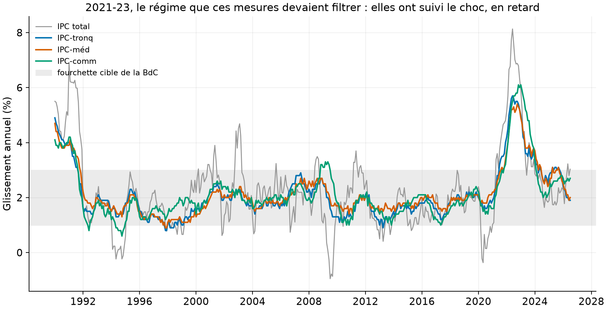
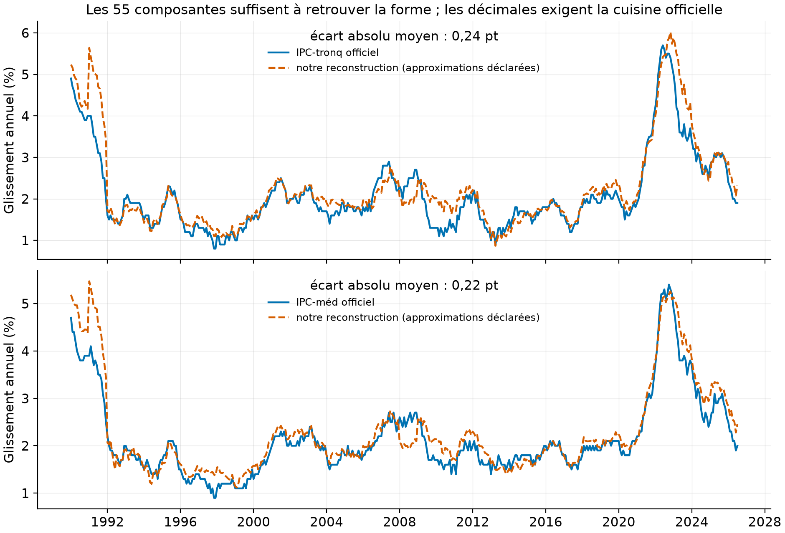

# L'inflation fondamentale à l'épreuve du choc : le concours rejoué, la recette refaite

Les trois mesures d'inflation fondamentale de la Banque du Canada ont gagné leur place
sur des données d'avant 2019 ; le choc de 2021-23 est exactement le régime qu'elles
devaient filtrer. Ce dépôt rejoue le concours de Lao et Steyn à travers le choc, et
reconstruit IPC-tronq et IPC-méd depuis les 55 composantes, écart mesuré à l'officiel.
*English summary below.*

## En bref

1. **Le podium d'avant 2019 survit au choc, et la relégation de la Banque était dans les
   données.** Sur le critère prédictif (RMSE de l'IPC total à 12 mois) : IPC-tronq gagne
   sur l'échantillon long (0,89 point) COMME sur 2016-2025 (1,18) ; l'IPC-comm, que la
   Banque a déclassé en 2022, finit dernier des trois mesures officielles dans les deux
   fenêtres (1,02 puis 1,40). Le choc n'a pas rebattu les cartes, il a juste rendu tout
   le monde moins précis (+30 à +40 % de RMSE). (Mesuré.)
2. **Les 55 composantes suffisent à retrouver la forme ; les décimales exigent la
   cuisine officielle.** Notre reconstruction (tronquage à 20 % de poids par queue,
   médiane pondérée) colle à l'officiel à 0,24 point d'écart absolu moyen pour IPC-tronq
   et 0,22 pour IPC-méd (corrélations 0,95 et 0,96 sur 439 mois), avec TROIS
   approximations déclarées : pas de correction des impôts indirects, STL au lieu du
   X-13 officiel, panier de poids statique. L'écart maximal (1,7 point) tombe sur
   1991, l'introduction de la TPS : l'omission déclarée se voit exactement là où la
   théorie la met. (Mesuré.)
3. **Deux guichets, une seule vérité :** les mesures officielles publiées par StatCan
   (18-10-0256) et par Valet (BdC) coïncident exactement sur l'échantillon commun
   (contrôle croisé, `results/tables/controle_valet.csv`). (Mesuré.)

## La question

En 2016, la Banque du Canada a retenu IPC-tronq, IPC-méd et IPC-comm à l'issue d'un
concours (Khan, Morel et Sabourin 2013 ; Lao et Steyn 2019) couru sur des données où
l'inflation dormait entre 1 et 3 %. Or 2021-23 a envoyé l'IPC total à 8 % et les mesures
fondamentales au-dessus de 5 % : le régime que ces filtres devaient justement absorber.
Rejouées à travers le choc, gagnent-elles encore leur propre concours ?

## Les données (100 % libres, licence ouverte de StatCan, jamais commitées)

| Source | Contenu | Statut |
|---|---|---|
| StatCan 18-10-0004 (API WDS) | IPC mensuel NON désaisonnalisé par produit, Canada | mesuré |
| StatCan 18-10-0007 | poids du panier au mois de raccord, par période de base | mesuré |
| StatCan 18-10-0256 | IPC-tronq, IPC-méd, IPC-comm officiels (une décimale publiée) | mesuré |
| BdC Valet `CPI_TRIM, CPI_MEDIAN, CPI_COMMON` | le miroir des mêmes séries | mesuré |

La liste des 55 composantes vient de la table A1 du document méthodologique officiel
(programme 2301 de StatCan, rapporté), recopiée dans `components.py` : le chargeur ÉCHOUE
si une composante manque, plutôt que de calculer sur un panier incomplet.

## Volet 1 : le concours de Lao-Steyn, rejoué à travers le choc

Les critères du papier : le biais (la moyenne de l'écart à l'IPC total), le lissage
(l'écart-type des variations mensuelles) et le pouvoir prédictif (le RMSE de la
régression de l'inflation totale moyenne des 12 et 24 prochains mois sur la mesure
courante, pleine période comme chez Lao-Steyn, déclaré). Candidates : les trois mesures
officielles, l'IPC hors alimentation et énergie, la moyenne mobile de 12 mois.

| RMSE à 12 mois (pt) | Échantillon long (1990-) | 2016-2025 |
|---|---|---|
| **IPC-tronq** | **0,89** | **1,18** |
| IPC-méd | 0,95 | 1,29 |
| IPC-comm | 1,02 | 1,40 |
| Hors alimentation-énergie | 1,01 | 1,36 |
| Moyenne mobile 12 mois | 1,10 | 1,52 |

**Lecture guidée.** Trois enseignements mesurés. L'IPC-tronq garde son premier rang dans
les deux fenêtres : le choix de 2016 tient. L'IPC-comm est dernier des mesures
officielles partout, et la Banque l'a rétrogradé en 2022 après ses grandes révisions :
sa relégation se lisait déjà dans le critère prédictif. Et TOUTES les mesures perdent 30
à 40 % de précision sur 2016-2025 : le choc n'a pas changé le classement, il a coûté à
tout le monde. Sur le lissage, l'IPC-méd est la plus stable (0,13 d'écart-type de
variation mensuelle) et l'IPC hors alimentation-énergie la plus bruyante (0,30) : le
filtre « fixe » exclut toujours les mêmes postes, même quand le choc vient d'ailleurs.



**Comment lire cette figure.** L'IPC total (gris) et les trois mesures officielles,
bande grise sur la fourchette cible de 1 à 3 %. En 2021-23, les mesures fondamentales
montent à 5-6 % : elles ont filtré le sommet de 8 % mais suivi le gros du choc, avec
retard à la montée COMME à la descente. Un filtre de tendance n'est pas un bouclier.

## Volet 2 : la recette refaite, et ce que l'écart enseigne

La méthode officielle (document 2301, rapporté) : 55 composantes, corrigées des impôts
indirects, désaisonnalisées (44 sur 55, X-13), variations MENSUELLES, tronquage à 20 %
de poids dans chaque queue ou médiane pondérée, poids au mois de raccord du panier.
Notre reconstruction assume trois approximations, toutes déclarées : pas de correction
des impôts indirects, STL robuste sur les 55, panier de poids statique (le plus récent).
Les mathématiques du tronquage et de la médiane pondérée sont, elles, exactes et testées
sur cas à la main (poids partiels aux bornes compris).



**Comment lire cette figure.** L'officiel (bleu) et notre reconstruction (tirets orange)
pour IPC-tronq (haut) et IPC-méd (bas). La forme est retrouvée partout : corrélations de
0,95 et 0,96, écarts absolus moyens de 0,24 et 0,22 point
(`results/tables/ecarts_reconstruction.csv`). Les écarts se concentrent où les
approximations mordent : autour de 1991 (la TPS entre en vigueur, et c'est la correction
des impôts indirects que nous omettons, écart maximal de 1,7 point) et pendant le choc
de 2021-23 pour la tronquée (0,48 point d'écart moyen, quand la désaisonnalisation et
les poids comptent le plus). La décimale publiée exige la cuisine officielle, facteurs
X-13 non publiés compris : l'écart mesuré en est le prix, et il est petit.

## Reproduire

```bash
uv sync --locked --all-extras
uv run pytest        # 9 tests fermés, sans réseau
uv run infc fetch    # 3 tables StatCan + Valet (~17 Mo)
uv run infc lab      # reconstruction + concours : 6 tables, 3 figures (~3 min, STL sur 55 séries)
```

Les tests, tous à la main : la médiane pondérée sur cas frontière (le 50e percentile
appartient à la composante qui ferme exactement à 0,5, convention du percentile
inférieur) et sur cas franc ; le tronquage avec poids partiels aux bornes ; le cas
dégénéré toutes-composantes-égales ; la composition mensuelle vers le glissement annuel
(1,003 puissance 12) ; la STL qui retire une saisonnalité plantée ; le concours qui
préfère le vrai signal au bruit ; les 55 composantes uniques.

## Limites, avec statut

1. **Trois approximations dans la reconstruction, chacune déclarée** : impôts indirects
   non corrigés (l'écart de 1991 en est la signature, mesuré), STL au lieu de X-13 (les
   facteurs officiels ne sont pas publiés), panier de poids statique au lieu des paniers
   successifs au mois de raccord. L'écart de 0,22-0,24 point est leur prix total ; la
   décomposition entre les trois n'est pas isolée. (Déclaré.)
2. **Le critère prédictif est en pleine période**, comme chez Lao-Steyn : c'est une
   comparaison de mesures, pas un exercice de prévision en temps réel ; une version
   récursive serait plus dure et la suite naturelle. (Déclaré.)
3. **Les données de 18-10-0004 sont les séries COURANTES**, révisées : pas de millésimes
   point-in-time pour l'IPC (les révisions de l'IPC non désaisonnalisé sont rares,
   rapporté ; celles des mesures officielles, réelles, la Banque ayant documenté les
   révisions de l'IPC-comm). (Déclaré.)
4. **L'IPC-comm n'est pas reconstruit** (modèle à facteur sur glissements annuels,
   publié en variation seulement, déclassé par la Banque depuis 2022) : il concourt au
   volet 1 via sa série officielle, c'est tout. (Déclaré.)
5. **Le choc de 2021-23 n'offre qu'un cycle.** Le classement qui y survit est un
   constat, pas une garantie pour le prochain régime. (Déclaré.)

## Références

- Lao, H. et C. Steyn (2019), « A comprehensive evaluation of measures of core
  inflation in Canada: an update », Banque du Canada, Staff Discussion Paper 2019-9.
- Khan, M., L. Morel et P. Sabourin (2013), « The common component of CPI: an
  alternative measure of underlying inflation for Canada », Banque du Canada, WP
  2013-35 ; et (2015), Staff Discussion Paper 2015-12.
- Banque du Canada (2016), *Renouvellement de la cible de maîtrise de l'inflation*,
  document d'information.
- Statistique Canada, document méthodologique des mesures de la Banque du Canada
  (programme 2301) : la méthode et la table A1 des 55 composantes.

## English summary

The Bank of Canada's three preferred core inflation measures won their 2016 selection on
pre-2019 data; 2021-23 delivered exactly the regime they were built to filter. (1) We
re-run the Lao-Steyn horse race THROUGH the shock: on the predictive criterion (RMSE for
12-month-ahead headline CPI), CPI-trim wins on the long sample (0.89 pt) AND on
2016-2025 (1.18); CPI-common, which the Bank demoted in 2022 after large revisions,
ranks last of the three official measures in both windows (1.02, then 1.40): the
demotion was already in the data. Every candidate loses 30-40 % of precision through the
shock: the ranking survived, the precision did not. (2) We rebuild CPI-trim and
CPI-median from the official 55-component list (Table A1, hard-coded, loader fails loudly
if any component is missing): weighted 20 %-per-tail trim and weighted median, with
three declared approximations (no indirect-tax adjustment, STL instead of the
unpublished X-13 factors, static basket weights). Result: mean absolute gap of 0.24 pt
(trim) and 0.22 pt (median) to the official series over 439 months, correlations
0.95-0.96, with the largest gap exactly at the 1991 GST introduction, the signature of
the declared tax-adjustment omission. StatCan and Bank of Canada (Valet) copies of the
official series match exactly (cross-checked). Free data, open licence, 9 hand-computed
tests.

## Licence et citation

Code sous licence MIT ; rapport et figures CC BY 4.0. Données : Statistique Canada
(licence ouverte, attribution : « Source : Statistique Canada »), Banque du Canada
(attribution). Citer via `CITATION.cff`.
